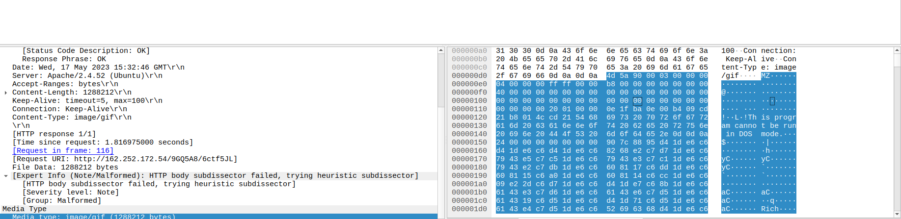

Wireshark Analysis of PCAP file

1. Install Wireshark on Ubuntu

To install Wireshark on an Ubuntu machine, use the following command:
> sudo apt-get install wireshark

2. Set Time Display to UTC Standard

In Wireshark:
Navigate to View 
Time display format -> Choose UTC

3. File Information and Hash Calculation

To check the file type:
> file <file_name>

To compute the SHA-256 hash:
> sha256sum <file_name>
Refer to 

4. Total Number of Packets in the PCAP

The serial number (leftmost column in Wireshark) indicates the total number of packets in the capture.
Total Packets Found: 39106

5. Identifying the First Queried and Resolved Domain

The first DNS query in the capture can be found by filtering: dns

The first resolved domain in this capture:
webmasterdev[.]com 
Refer to 

6. IP Address of the Queried Domain

After identifying the domain, look at the TCP handshake (SYN packets) to find the resolved IP address.
Resolved IP Address: 184.168.98.68
Refer to 

7. Base Domain that was continuously queried

To find the most frequently queried domain, apply the following filter: dns.qry.name
The most queried domain in this capture: steasteel[.]net
Refer to 

8. Identifying HTTP Packets in the Capture

Apply the following display filter to find HTTP packets: http
Total http packets: 8
Refer to 

9. Finding the Relative Path of the Downloaded File

Use this display filter to isolate HTTP GET requests: http.request.method == "GET"
Refer to 
Look at the Request URI field in the packet details.
Relative Path Accessed: 9GQ5A8/6ct5JL

10. File Format of the Downloaded File

Use this display filter to find HTTP responses: http.response
Refer to 

The Content-Type field in the HTTP response will show the file format.
File Format: image/gif
Refer to 

11. Identifying the Magic Bytes of the File

Magic bytes (file signature) appear at the beginning of the file.
The file starts with MZ, which is the signature for Windows Executable (EXE) files, not GIF.
This suggests that the file was disguised as a GIF but is actually an executable.
Refer to 

12. Program Used by the Victim to Download the File.

Check the User-Agent string in the GET request to identify the tool used.
User-Agent Found: Windows PowerShell
Refer to 

13. Extracting and Analyzing the Downloaded File

Export the file from Wireshark:
Wireshark → File → Export Objects → HTTP → Select File → Save
Refer to 

After extracting the file, compute its SHA-256 hash, then check its reputation using VirusTotal.
Identified Malware: trojan.midie/pikabot
Refer to 

PCAP file source: 
https://www.malware-traffic-analysis.net/
